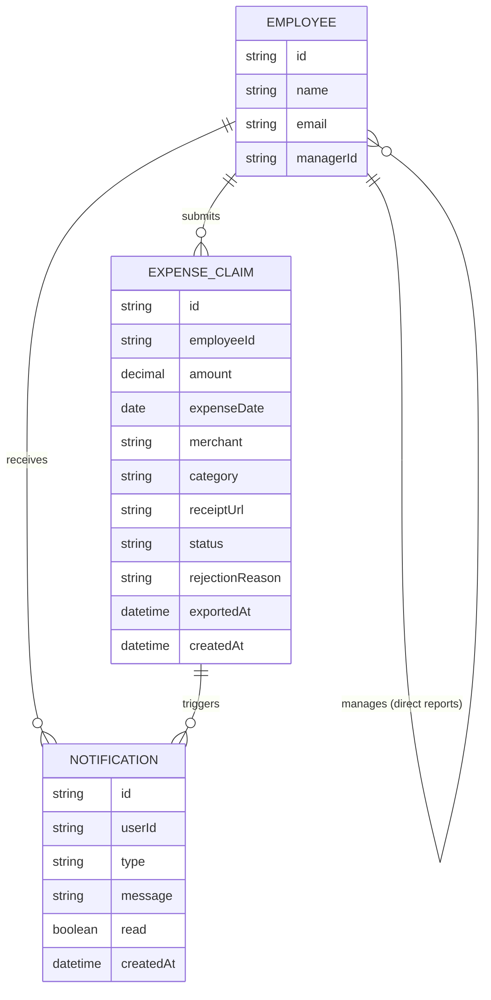

# Domain model

The core entities behind expense claims: employees (in a manager hierarchy),
the claims they submit, and the in-app notifications that keep everyone
informed.

An `EXPENSE_CLAIM.status` is one of `pending`, `approved`, `rejected`.
`rejectionReason` is set only when `status` is `rejected`. `exportedAt` is set
once finance includes the claim in a payroll export, and stays null until
then — an approved claim with `exportedAt` null is what payroll export lists.
`EMPLOYEE.managerId` is the self-relation a manager's "my team" queries use.