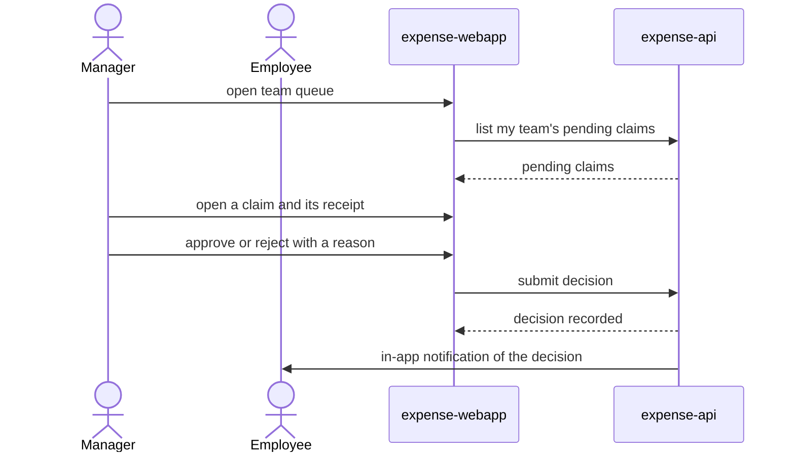

# A manager approves or rejects a claim

A manager reviews their team's pending claims, decides on one, and the
employee is notified of the decision.

```mermaid
sequenceDiagram
    actor Manager
    actor Employee
    participant expense-webapp
    participant expense-api

    Manager->>expense-webapp: open team queue
    expense-webapp->>expense-api: list my team's pending claims
    expense-api-->>expense-webapp: pending claims
    Manager->>expense-webapp: open a claim and its receipt
    Manager->>expense-webapp: approve or reject with a reason
    expense-webapp->>expense-api: submit decision
    expense-api-->>expense-webapp: decision recorded
    expense-api->>Employee: in-app notification of the decision
```