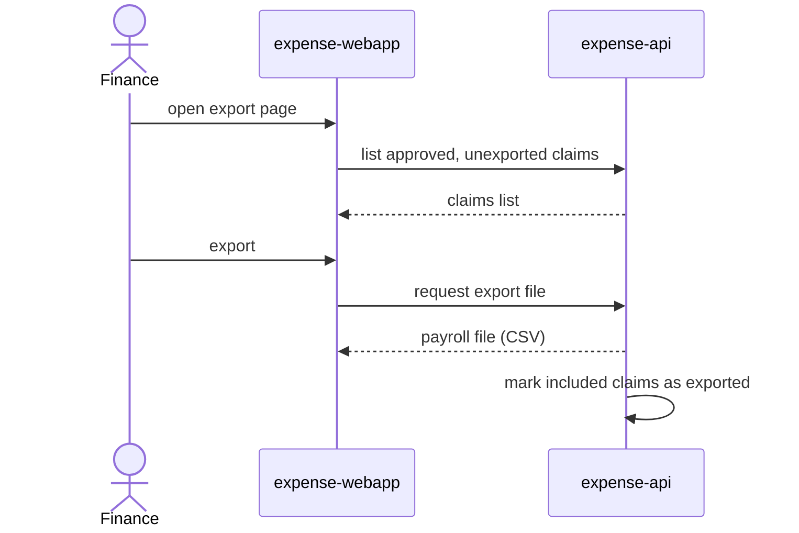

# Finance exports approved claims to payroll

Finance reviews approved claims not yet exported and downloads them as a
payroll file; each exported claim is excluded from later exports.

```mermaid
sequenceDiagram
    actor Finance
    participant expense-webapp
    participant expense-api

    Finance->>expense-webapp: open export page
    expense-webapp->>expense-api: list approved, unexported claims
    expense-api-->>expense-webapp: claims list
    Finance->>expense-webapp: export
    expense-webapp->>expense-api: request export file
    expense-api-->>expense-webapp: payroll file (CSV)
    expense-api->>expense-api: mark included claims as exported
```