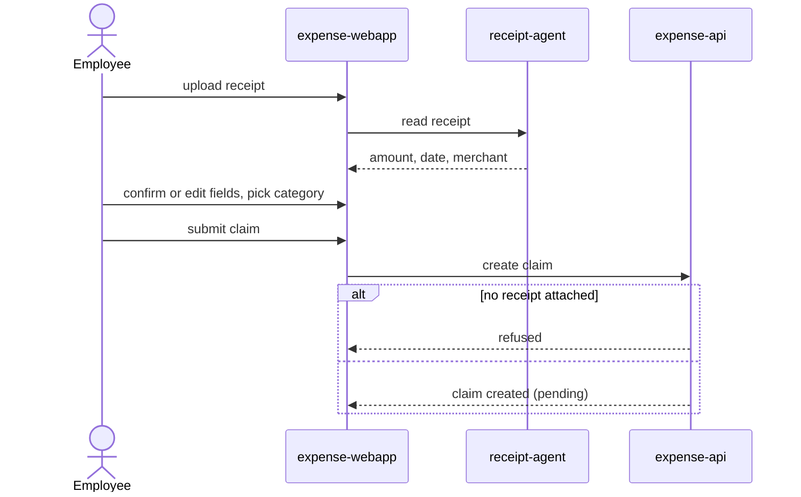

# Submit an expense claim

An employee uploads a receipt, the receipt reader agent pre-fills the claim's
fields, and the employee submits it for their manager's approval.

```mermaid
sequenceDiagram
    actor Employee
    participant expense-webapp
    participant receipt-agent
    participant expense-api

    Employee->>expense-webapp: upload receipt
    expense-webapp->>receipt-agent: read receipt
    receipt-agent-->>expense-webapp: amount, date, merchant
    Employee->>expense-webapp: confirm or edit fields, pick category
    Employee->>expense-webapp: submit claim
    expense-webapp->>expense-api: create claim
    alt no receipt attached
        expense-api-->>expense-webapp: refused
    else
        expense-api-->>expense-webapp: claim created (pending)
    end
```